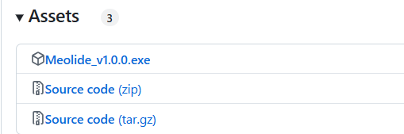

# 写在前面

#### 编码规范

- 窗口大小模定为`QSize(1280,720)`
- 类名使用大驼峰命名法`SettingsWidget`，而函数名和变量名使用小驼峰命名法`playWidget`
- 组件/控件对象 组件控件\_名字 `label_musicVolume`
- 中文字体使用思源黑体，西文字体使用 Saira

#### 文件组织

- ./src/\*.cpp
- ./include/\*.h
- ./ui/\*.ui
- ./res/{\$资源文件}

#### 项目推进参考资料

在项目开发中往往会遇到非常多的问题，比如一个功能的实现，一段函数的使用等等功能，我们希望在这个项目开发的过程中积累一些经验以便于遇到问题能够快速查找，同时运用这里的资源也能够少走一些坑。

[博客园：styleSheet 的几种用法](https://www.cnblogs.com/coffeegg/archive/2011/11/15/2249452.html)

# 项目简介

# 使用流程

如果你希望玩到==melody=，请按照以下流程操作。
本项目基于 C++和 Qt 开发，但是在安装我们的游戏时，您不需要配置额外的环境，请严格按照一下流程进行即可。

1.找到 release

2.在 release 中找到 exe 文件
选择与您的电脑适配的 exe 文件进行下载即可。项目过于庞大请耐心等待。

#

# 更新信息

## version1

## version2

本次更新在九月中秋期间，由开发者 njdldkl 对本项目进行优化和扩展，同时修复了许多 bug。下面是本次更新的内容：

###

###

# 支持与联系我们

如果你对于 melody 感兴趣，欢迎通过`2312454@mail.nankai.edu.cn`联系==njdldkl==,或者通过`2310460@mail.nankai.edu.cn`联系==Affordan==。我们非常欢迎您对我们的项目提出建议或者参与到我们的工作中来！

如果您对于该项目表示支持，请点击这里请我们喝咖啡。
link to be upload(doge).
